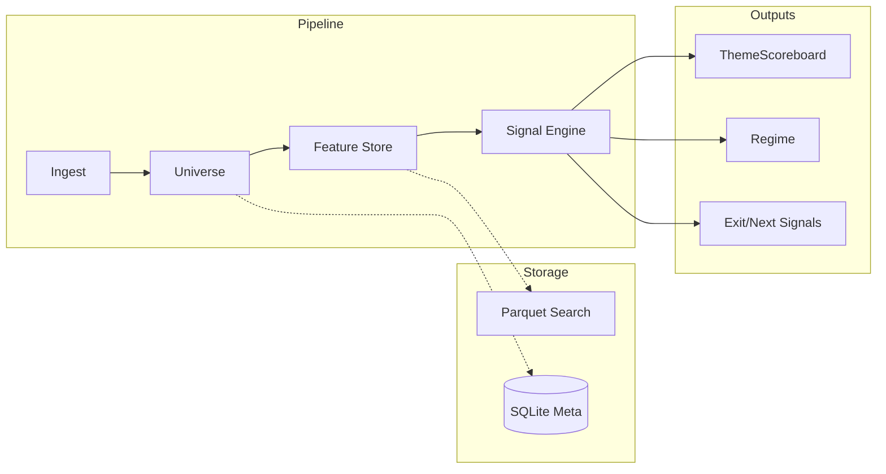

# 시스템 아키텍처 (Architecture)

#### 본 시스템은 테마의 생애주기(탄생-가속-쏠림-붕괴)를 데이터로 추적하는 것을 핵심 목표

테마 로테이션(순환) + 하락 전조 감지 + 다음 테마 후보 랭킹

## 🎯 4대 핵심 결과물 정의

### 1. ThemeScoreboard(t)
테마의 현재 위치를 측정하는 계기판 역할.
- **상대강도(RS)**: 지수 대비 초과 수익 성능 지표.
- **모멘텀**: 20일/60일 수익률 수준 데이터.
- **확산(Breadth)**: 테마 내 종목 동반 상승 여부 (상승 종목 수 / 전체 종목 수).
- **리스크**: 테마 변동성 및 최근 고점 대비 하락폭(DD) 관리.

### 2. Regime(t)
전략 실행 환경을 결정하는 '시장 고도' 지표.
- **Risk-On**: 주식 비중 확대 및 공격적 테마 로테이션 대응 국면.
- **Risk-Off**: 현금 비중 확대 및 방어주 위주의 테마 압축 국면.
- **주요 변수**: 지수 200MA 이격도, VIX 레벨, 장단기 금리차 등 활용.

### 3. ExitSignal(leader_theme, t)
현재 주도주 이탈 시점을 결정하는 리스크 신호.
- **경고 1단계 (Breadth 붕괴)**: 테마 지수는 상승하나 상승 종목 수는 급감하는 다이버전스 발생 시.
- **경고 2단계 (Concentration 심화)**: 시총 상위 극소수 종목만 상승하는 쏠림 현상 포착 시.
- **확정 단계 (Price 훼손)**: 주요 지지선(예: 20MA) 이탈 및 변동성 임계치 초과 시.

### 4. NextCandidates(t)
주도 테마 자금 유출 시 이동 가능성이 높은 차기 후보군 랭킹화.
- **근거 피처**: 최근 RS 개선세, 바닥권 거래량 급증, 국면별 역사적 상관성 등 반영.

---

## 📊 데이터 흐름 및 레이어 구성

## 💾 데이터 스키마 명세 (Data Contracts)

### 1. Raw Market Data (Parquet)
| 컬럼 | 타입 | 설명 |
| :--- | :--- | :--- |
| `date` | datetime | 거래 일자 (PK) |
| `ticker` | string | 종목 코드 (PK) |
| `open/high/low/close` | float | 수정 주가 기준 가격 데이터 |
| `volume` | long | 거래량 수치 |
| `amount` | long | 거래 대금 규모 |

### 2. Theme Mapping (SQLite)
| 컬럼 | 타입 | 설명 |
| :--- | :--- | :--- |
| `theme_name` | string | 테마 명칭 필드 |
| `ticker` | string | 포함 종목 코드 리스트 |
| `weight` | float | 테마 내 개별 종목 비중 (Equal weight 기본) |
| `effective_from` | date | 테마 편입 시작 시점 |
| `effective_to` | date | 테마 편입 종료 시점 |

### 3. Signal Results (Parquet)
| 컬럼 | 타입 | 설명 |
| :--- | :--- | :--- |
| `date` | datetime | 신호 발생 일자 |
| `theme_name` | string | 대상 테마 명칭 |
| `leader_score` | float | 주도 점수 (0-1 범위) |
| `exit_level` | int | 경고 레벨 정의 (0:정상, 1:주의, 2:위험) |
| `next_rank` | int | 차기 후보군 내 순위 정보 |

---

## ⚙️ 설계 원칙
- **Vectorized Calculation**: 반복문 배제 및 Pandas/Numpy 벡터 연산을 통한 처리 속도 최적화.
- **Stateless Engines**: 엔진별 독립적 입력/출력 구조 설계 및 내부 상태 의존성 제거.
- **Traceability**: 모든 신호 생성 근거 피처를 결과 데이터와 병합 저장하여 사후 분석 보장.
